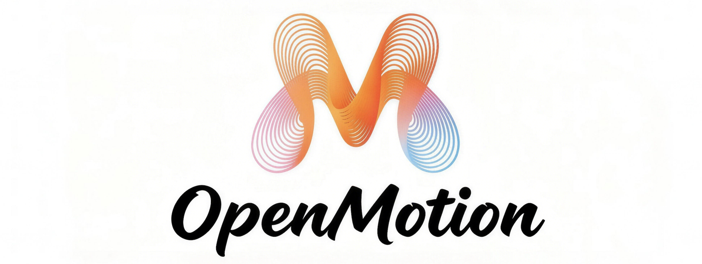

<div align="center">



# OpenMotion

### The AI-Native Motion Design Platform. 🕹️

**The Open-Source Motion Platform — a living web canvas fused with a professional motion graphics engine, native to AI.**

**Animations that live in real web pages and videos — conversational, composable, and reusable by any AI agent.**

> Motion design, where your agent designs. OpenMotion unifies a living web-native canvas with a full motion graphics engine — motion blur, null objects, trim paths, repeaters, echoes, time remapping — letting you stretch, bounce, and squash your ideas, then ship them as living artifacts and reusable skills.


#### [English](./README.md) | [中文文档](./README_CN.md)

</div>


## Overview

OpenMotion rethinks motion design from first principles. Instead of a timeline you stare at, you talk to a motion agent that builds, tunes, and ships animations inside the very medium where they run — HTML and video. Every template is alive the moment you select it; every component can be re-shaped in natural language; every motion you craft can be packaged as a **skill** and handed to any AI for reuse.

It is motion design as a living artifact, not a static file.


## Why OpenMotion

Traditional motion tools split into two camps: web-canvas tools that stop at simple transitions, and timeline-heavy motion graphics suites that live behind export pipelines. OpenMotion closes that gap with an original architecture: a living, web-native canvas where animations run where they ship, paired with a complete motion graphics engine authored from first principles — motion blur, null objects, trim paths, repeaters, echoes, time remapping, layer effects. All of it, native to the browser, native to AI.

We optimize for the **loop** — the cycle of intent, preview, refinement, and reuse that real product work demands. An animation is not a deliverable; it is a **transferable unit of design knowledge** that flows between humans and AI.

- **Motion as code, not as a project file.** No import, no export pipeline. The animation *is* the page.
- **Conversation as the cursor.** You describe intent; the agent edits the curve, the timing, the layer.
- **One canvas, one engine, one agent.** A living web preview fused with a professional motion graphics engine — one surface, one timeline, one agent.
- **Skills as the currency.** A great animation becomes a reusable primitive any AI agent can call.


## Features

### Polished motion in a prompt
Create pro-level animations through conversation with OpenMotion's motion agent. Use it for a single repeated move or a full multi-scene story — describe the feeling, the agent shapes the frames.

### Full command of every keyframe
When you want precision, the timeline is yours. Set every frame and property exactly. Conversational editing and keyframe control coexist — switch between them at any moment.

### Expansive creativity, precise control
Bring clarity and expression to your work. Animate loading states, hover interactions, logo reveals, transitions — the timeline is the limit.

- **Pre-made style primitives.** A curated style library — Fade, Rotate, Scale, Resize, Spring, Bounce, Squash & Stretch — ready to stack into your vision.
- **Physical easing studio.** Bezier curves and spring physics as first-class citizens. Customize each keyframe with the curve it deserves.
- **Spatial motion.** 2D transforms plus depth — combine motion with 3D transforms so objects move like they do in the real world.
- **Screen-to-screen choreography.** Every transition carries its own full timeline, with per-element timing you can shape independently.

### Professional motion graphics, in the browser
The depth of a motion graphics engine, without the export pipeline. Pro-grade primitives you can speak into existence — every one of them callable by the Agent as a tool.

- **Motion Blur.** Velocity-aware streaking with adjustable intensity and shutter angle — the cinematic 180° default, or long 360° streaks, or crisp 45° motion.
- **Null Objects.** Invisible controller layers that drive groups via parent-child hierarchies — organize complex rigs without painting a single pixel.
- **Trim Path.** Progressive path reveals via `stroke-dasharray` / `stroke-dashoffset` — write-on strokes, line-draw logos, SVG-style reveals.
- **Repeater.** Duplicate a layer N times with transform offsets (x / y / rotate / scale) and opacity decay — radial, linear, or grid patterns from a single source.
- **Echo.** Motion-trail afterimages — N delayed copies with fading opacity and optional scale shrink, for tracer and tail effects.
- **Time Remap.** Per-layer playback rate — 2× speed, 0.5× slow, freeze at a specific frame, or reverse. Independent of the global timeline.
- **Layer Effects.** Drop shadow, inner shadow, outer glow, inner glow, stroke outline — all via composable CSS `box-shadow`, with hex+opacity color control.

### Build motion systems once, apply them everywhere
Motion systems let your whole team quickly add on-brand motion assets anywhere.

- **Reusable components across assets.** Systematize common moves — no need to build from scratch every time. Create modes and components that work wherever they're applied.
- **Skill pipeline.** Package any motion as a self-contained, AI-callable skill — the same primitive flows across projects, teams, and agent workflows.

### Per-component fine-tuning
Every animation is composed of independent components. Tune one without disturbing the rest — adjust a single element's easing, delay, or transform while the surrounding choreography stays intact.

### One-click reuse to HTML & video
A selected motion exports directly to production-ready HTML or a rendered video clip. The same artifact that runs in your browser is the artifact you ship.

- **Multi-format export.** Turn any animated frame into MP4, GIF, WebM, or clean HTML/CSS — whatever the destination demands.

### Ship animation straight to code
All animations are backed by real, production-ready code.

- **Code-native output.** Inspect the entire motion timeline and copy animation code directly into CSS, JSON, or React.
- **MCP-native agent context.** Send animation code to your agentic coding tools via the MCP server. All values — ease, timing, transforms — are preserved end to end.

### Export any motion as a skill
This is OpenMotion's defining idea. Any animation — yours, ours, or remixed — can be packaged as a **skill**: a self-contained, AI-callable motion unit. Drop it into your agent's toolkit and it becomes a reusable capability across projects, teams, and workflows.

### Agent-native by design
OpenMotion is built to be driven by AI agents, not merely used by humans. The platform exposes motion as a first-class programmable surface — queryable, editable, and composable through natural language and structured calls alike.


## Getting Started

```bash
# Clone the repository
git clone https://github.com/Yuan-ManX/open-motion.git
cd open-motion

npm install

npm run dev
```


## Architecture

OpenMotion is organized around four founding pillars:

| Pillar | Responsibility |
| --- | --- |
| **Template Library** | A curated, ever-growing set of top-tier motion templates, alive on arrival. |
| **Motion Agent** | The conversational core — translates intent into precise parameter and keyframe changes. |
| **Live Runtime** | Runs animations in real web pages and video frames; the same surface that ships. |
| **Skill Pipeline** | Packages any motion into a self-contained, AI-callable, reusable unit. |

Together they form a closed loop: *select → run → refine → ship → reuse*.


## Contributing

Contributions are welcome! Please read our contributing guidelines before submitting pull requests.

## License

OpenMotion is licensed under the MIT License. See [LICENSE](./LICENSE) for details.

## ⭐ Star History

If you like this project, please ⭐ star the repo. Your support helps us grow!

<p align="center">
  <a href="https://star-history.com/#Yuan-ManX/open-motion&Date">
    
  </a>
</p>
